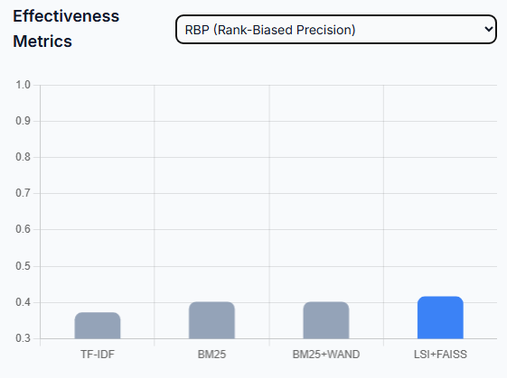
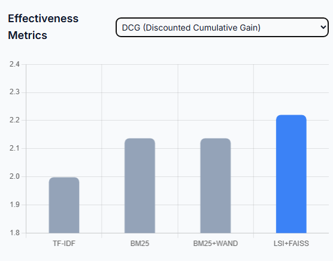
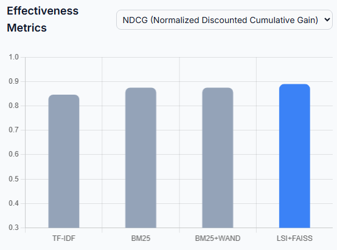
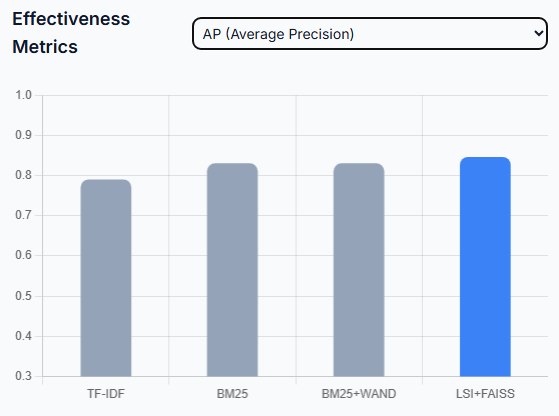

# Search Engine From Scratch

### How To Run


#### 1) `bsbi.py`

Run (all args in one):
```
python bsbi.py --debug --spimi
```

Args:
- `--debug` (default: `False`): Compare all postings encodings and print index size + indexing time.
- `--spimi` (default: `False`): Use SPIMI indexing instead of BSBI.

#### 2) `lsi_faiss.py`

Build mode (all build args in one):
```
python lsi_faiss.py build --collection collection --output-dir lsi_index --n-components 256 --min-df 2 --max-df 0.9 --index-type ivf --nlist 256 --hnsw-m 32 --ef-construction 200
```

Query mode (all query args in one):
```
python lsi_faiss.py query --output-dir lsi_index --text "lipid metabolism in pregnancy" --topk 10
```

Default command behavior:
- If no subcommand is provided, command defaults to `build`.

Build args:
- `--collection` (default: `collection`): Collection root directory.
- `--output-dir` (default: `lsi_index`): Output directory for saved LSI/FAISS artifacts.
- `--n-components` (default: `256`): Number of latent SVD dimensions.
- `--min-df` (default: `2`): Minimum document frequency threshold.
- `--max-df` (default: `0.9`): Maximum document frequency ratio.
- `--index-type` (default: `ivf`, choices: `flat | ivf | hnsw`): FAISS index type.
- `--nlist` (default: `256`): IVF cluster count upper bound.
- `--hnsw-m` (default: `32`): HNSW neighbor count.
- `--ef-construction` (default: `200`): HNSW construction effort.

Query args:
- `--output-dir` (default: `lsi_index`): Directory containing built LSI/FAISS artifacts.
- `--text` (required): Query text.
- `--topk` (default: `10`): Number of top results to return.

#### 3) `search.py`

Run (all args in one):
```
python search.py --spimi --patricia --adaptive-retrieval --adaptive-index-dir pt_index --lsi-faiss --lsi-output-dir lsi_index --topk 10
```

Disable toggles:
```
python search.py --no-adaptive-retrieval --no-lsi-faiss
```

Args:
- `--spimi` (default: `False`): Use SPIMI index class instead of BSBI index class.
- `--patricia` (default: `False`): Enable Patricia Tree lookup for query terms.
- `--adaptive-retrieval` (default: `True`): Enable adaptive retrieval output.
- `--no-adaptive-retrieval` (default: not set): Disable adaptive retrieval output.
- `--adaptive-index-dir` (default: `pt_index`): Adaptive retrieval index artifact directory.
- `--lsi-faiss` (default: `True`): Enable LSI+FAISS retrieval output.
- `--no-lsi-faiss` (default: not set): Disable LSI+FAISS retrieval output.
- `--lsi-output-dir` (default: `lsi_index`): LSI+FAISS artifact directory.
- `--topk` (default: `10`): Top-k retrieval depth.

#### 4) `evaluation.py`

Run (all args in one):
```
python evaluation.py --qrels qrels.txt --queries queries.txt --k 10 --use-patricia --lsi-output-dir lsi_index --use-adaptive-retrieval --adaptive-index-dir pt_index
```

Args:
- `--qrels` (default: `qrels.txt`): Path to qrels relevance file.
- `--queries` (default: `queries.txt`): Path to queries file.
- `--k` (default: `10`): Top-k documents per query.
- `--use-patricia` (default: `False`): Use Patricia Tree lookup in retrieval.
- `--lsi-output-dir` (default: `lsi_index`): Directory containing LSI+FAISS artifacts. Set empty to disable LSI evaluation.
- `--use-adaptive-retrieval` (default: `False`): Enable adaptive retrieval evaluation.
- `--adaptive-index-dir` (default: `pt_index`): Directory containing adaptive retrieval index artifacts.

## Deliverables
### 1. Adding Elias-Gamma Compression

Comparing 5 types of compression
```
Codec                                  Size (KB)     Time (s)
--------------------------------------------------------------
StandardPostings                        1557.372        2.281
VBEPostings                             1024.439        2.543
EliasGammaPostings                      1022.873        3.377
VBEPostingsEliasGammaTF                  999.328        3.100
EliasGammaPostingsVBETF                 1048.614        3.104
```

Conclusion:
- We picked VBEPostingsEliasGammaTF from this forth since it has smallest size (effective compression)

### 2. Adding BM25

Comparing TF-IDF with BM25 over 30 queries
```
TF-IDF RBP = 0.5980
BM25   RBP = 0.6317
```

Conclusion:
- BM25 has bigger RBP score than TF-IDF

### 3. Adding 3 More Evaluation Metrics: NDCG, DCG, & AP

Evaluation results over 30 queries:
```
TF-IDF RBP  = 0.6052
TF-IDF DCG  = 5.4224
TF-IDF NDCG = 0.7904
TF-IDF AP   = 0.5180

BM25   RBP  = 0.6467
BM25   DCG  = 5.6135
BM25   NDCG = 0.8145
BM25   AP   = 0.5559
```


### 4. Adding WAND Top-K Retrieval for BM25
```
BM25 brute-force avg/query (s) = 0.0541
BM25 WAND avg/query (s)        = 0.0523
```
Conclusion:
- BM25 using WAND top-K retrieval achieve faster average retrieval time taken than without WAND

Visualized:
- RBP (Rank-Biased Precision)




- DCG (Discounted Cumulative Gain)



- NDCG (Normalized DCG) 




- AP (Average Precision)



Conclusions:
- Best Quality: LSI+FAISS is the most effective method across all ranking metrics (RBP, DCG, NDCG, and AP).
- Efficiency Leader: LSI+FAISS is significantly faster than the other methods, representing a ~9.3x speedup over traditional brute-force BM25.

## Bonus

### 5. Adding SPIMI
```
python bsbi.py --spimi
```
BSBI VS SPIMI:
- BSBI (Block-Sort-Based Indexing)
    - Processes each block (directory) separately
    - Creates one inverted index per block
    - Fixed memory usage per block
    - Merges all block indices at the end

- SPIMI (Single-Pass In-Memory Indexing)
    - Processes all documents sequentially
    - Maintains a single in-memory dictionary
    - Dynamically flushes to disk when memory threshold is exceeded
    - More memory-efficient for varying document sizes
    - Merges all flushed blocks at the end

### 6. Adding Patricia Tree

```
python .\evaluation.py --use-patricia
```

Patricia Tree visualizations of the whole vocabulary
- Normal [[html]](html/patricia-tree.html)

- Mindmap [[html]](html/patricia-tree-mindmap.html)

- Folders [[html]](html/patricia-tree-folder.html)


### 7. Adding LSI + FAISS (Vector Indexing)

Build latent semantic index (LSI) and FAISS vector index. Efficient SVD strategy for very large term-document matrices:
- Use sparse TF-IDF matrix (do not densify term-document matrix).
- Use randomized truncated SVD (not full SVD), with cost close to linear in non-zero entries.
- Keep latent dimension moderate (e.g., 128-512).
- Use FAISS approximate indexes (IVF or HNSW) for scalable top-k retrieval.
- For IVF, train on a sampled subset of vectors when corpus is very large.