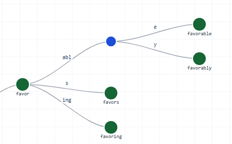
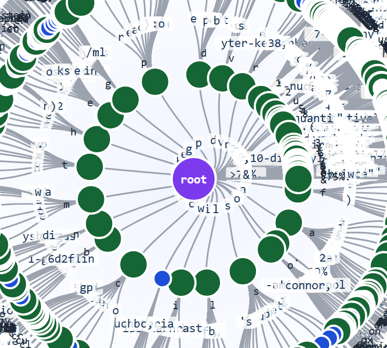
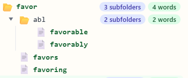

# Search Engine From Scratch

### How To Run

Run evaluation (default, without Patricia lookup):
```
python evaluation.py --k 10
```

Run evaluation with Patricia term lookup enabled:
```
python evaluation.py --k 10 --use-patricia
```

Run evaluation with adaptive retrieval comparison:
```
python evaluation.py --k 10 --use-adaptive-retrieval --adaptive-index-dir pt_index
```

Run search with adaptive retrieval:
```
python search.py --adaptive-retrieval --adaptive-index-dir pt_index
```


### 1. Adding Elias-Gamma Compression

Comparing 5 types of compression
```
Codec                                  Size (KB)     Time (s)
--------------------------------------------------------------
StandardPostings                        1557.372        2.281
VBEPostings                             1024.439        2.543
EliasGammaPostings                      1022.873        3.377
VBEPostingsEliasGammaTF                  999.328        3.100
EliasGammaPostingsVBETF                 1048.614        3.104
```

Conclusion: VBEPostingsEliasGammaTF -> smallest size

### 2. Adding BM25

Comparing TF-IDF with BM25 over 30 queries
```
TF-IDF RBP = 0.5980
BM25   RBP = 0.6317
```

### 3. Adding 3 More Evaluation Metrics: NDCG, DCG, & AP

Evaluation results over 30 queries:
```
TF-IDF RBP  = 0.6052398617530756
TF-IDF DCG  = 5.422493684952236
TF-IDF NDCG = 0.7904113437261435
TF-IDF AP   = 0.518025692430456
BM25   RBP  = 0.6467038364528055
BM25   DCG  = 5.613506000661405
BM25   NDCG = 0.8144864857338686
BM25   AP   = 0.5558783234012998
```

### 4. Adding WAND Top-K Retrieval for BM25
```
BM25 brute-force avg/query (s) = 0.0541
BM25 WAND avg/query (s)        = 0.0523
```

## Bonus

### 5. Adding SPIMI
```
python bsbi.py --spimi
```
BSBI (Block-Sort-Based Indexing)
- Processes each block (directory) separately
- Creates one inverted index per block
- Fixed memory usage per block
- Merges all block indices at the end

SPIMI (Single-Pass In-Memory Indexing)
- Processes all documents sequentially
- Maintains a single in-memory dictionary
- Dynamically flushes to disk when memory threshold is exceeded
- More memory-efficient for varying document sizes
- Merges all flushed blocks at the end

### 6. Adding Patricia Tree

```
python .\evaluation.py --use-patricia
```

Patricia Tree visualizations:
- Normal

- Mindmap

- Folders


### 7. Adding LSI + FAISS (Vector Indexing)

Build latent semantic index (LSI) and FAISS vector index:
```
python lsi_faiss.py build --collection collection --output-dir lsi_index --n-components 256 --index-type ivf
```

Query the LSI+FAISS index:
```
python lsi_faiss.py query --output-dir lsi_index --text "lipid metabolism in pregnancy" --topk 10
```

Efficient SVD strategy for very large term-document matrices:
- Use sparse TF-IDF matrix (do not densify term-document matrix).
- Use randomized truncated SVD (not full SVD), with cost close to linear in non-zero entries.
- Keep latent dimension moderate (e.g., 128-512).
- Use FAISS approximate indexes (IVF or HNSW) for scalable top-k retrieval.
- For IVF, train on a sampled subset of vectors when corpus is very large.